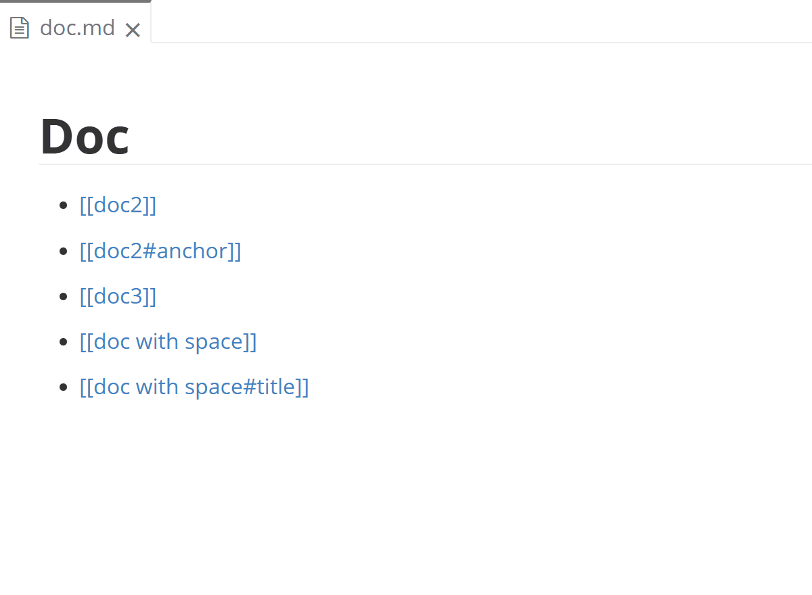
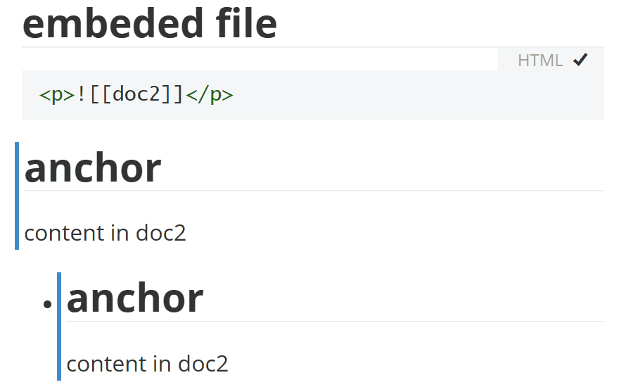

# Typora Plugin Wikilink

English | [简体中文](https://github.com/typora-community-plugin/typora-plugin-wikilink/blob/main/README.zh-CN.md)

This is a plugin based on [typora-community-plugin](https://github.com/typora-community-plugin/typora-community-plugin) for [Typora](https://typora.io).

Supports wikilinks like `[[text]]`.

- Wraps wikilinks with the HTML tag `<a>`, but the HTML tag is not saved into the Markdown file.
- <kbd>Ctrl</kbd>+<kbd>Alt</kbd>+<kbd>K</kbd> toggles focused/selected text between plain text and wikilink style.
- <kbd>Ctrl</kbd>+Click opens the file whose name matches the wikilink.
- (Optional) Typing `[[` triggers wikilink suggestions.
- (Optional) <kbd>Ctrl</kbd>+<kbd>Shift</kbd>+Click previews the linked file in a floating window.
- (Optional) Clicking `[[name]].md` in the file explorer opens `name.md`.

## Preview

| Jump                         | Floating View                          |
 |:---------------------------:|:--------------------------------------:|
 |  |    |
 | Embedded File                |                                        |
 |  |                                    |
