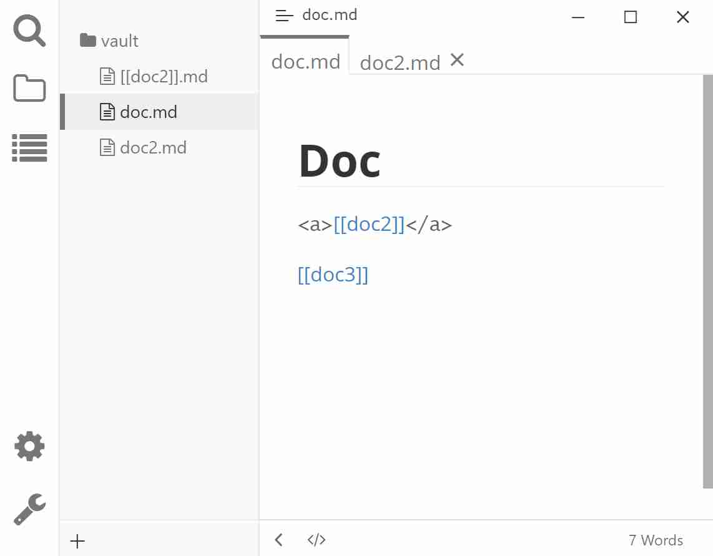

# Typora Plugin Wikilink

[English](https://github.com/typora-community-plugin/typora-plugin-wikilink#README.md) | 简体中文

这是一个基于 [typora-community-plugin](https://github.com/typora-community-plugin/typora-community-plugin) 开发的，适用于 [Typora](https://typora.io) 的插件。

支持如 `[[text]]` 的 wikilink。

- 使用 HTML 标签 `<a>` 包裹 wikilink，但是 HTML 标签并不会被保存到 Markdown 文件中。
- <kbd>Ctrl</kbd>+<kbd>Alt</kbd>+<kbd>K</kbd> 令 光标附件/选中 文本在纯文本和 Wikilink 样式间切换。
- <kbd>Ctrl</kbd>+鼠标单击 打开文件名匹配 Wikilink 的文件。
- 输入 `[[` 触发 wikilink 建议。
- (可选) 在文件管理器中点击 `[[name]].md` 将打开 `name.md`。

## 预览

