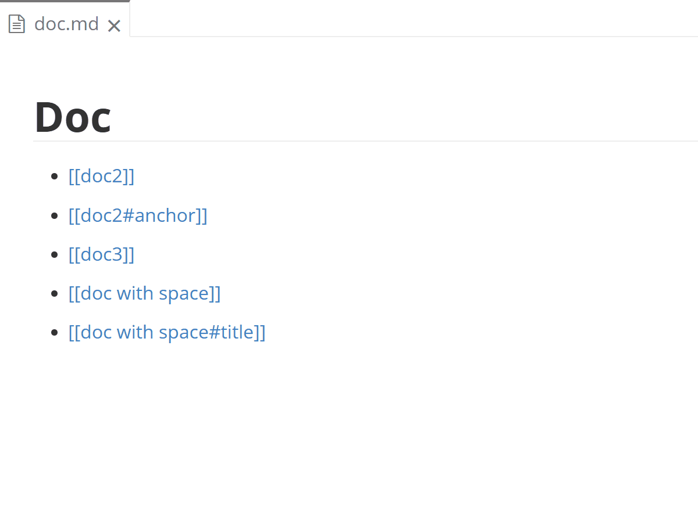
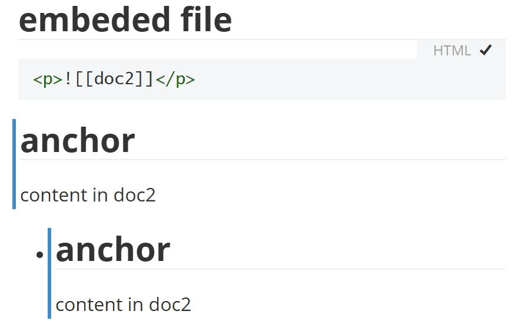

# Typora Plugin Wikilink

[English](./README.md) | 简体中文

这是一个基于 [typora-community-plugin](https://github.com/typora-community-plugin/typora-community-plugin) 开发的，适用于 [Typora](https://typoraio.cn) 的插件。

支持如 `[[text]]` 的 wikilink。

- ~~使用 HTML 标签 `<a>` 包裹 wikilink，但是 HTML 标签并不会被保存到 Markdown 文件中。~~（新版本不需要包裹 `<a>`，更简洁）
- <kbd>Ctrl</kbd>+<kbd>Alt</kbd>+<kbd>K</kbd> 令 光标附近/选中 文本在纯文本和 Wikilink 样式间切换。
- <kbd>Ctrl</kbd>+鼠标单击 打开文件名匹配 Wikilink 的文件。
- (可选) 输入 `[[` 触发 wikilink 建议。
- (可选) <kbd>Ctrl</kbd>+<kbd>Shift</kbd>+鼠标单击 在浮动窗口中预览链接的文件。
- (可选) 在文件管理器中点击 `[[name]].md` 将打开 `name.md`。

## 预览

| 跳转                              | 浮动视图                             |
|:---------------------------------:|:------------------------------------:|
|        |  |
| 嵌入文件                           |                                      |
|  |                                      |
